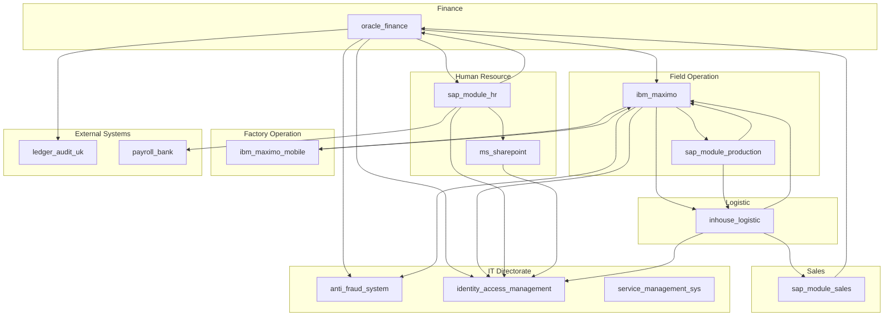
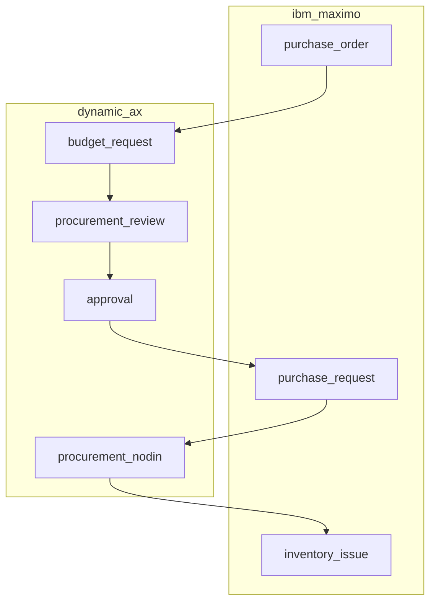
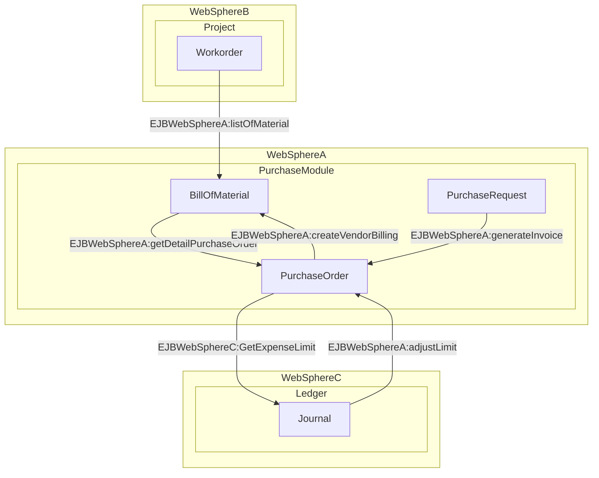
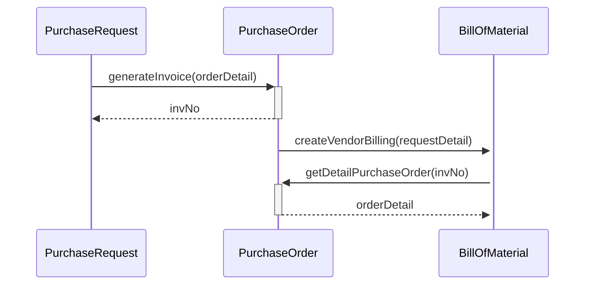
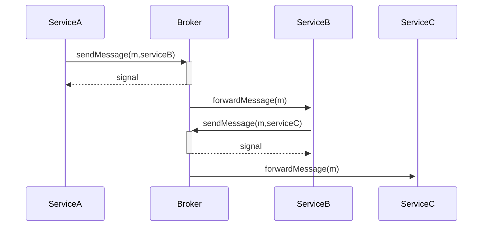
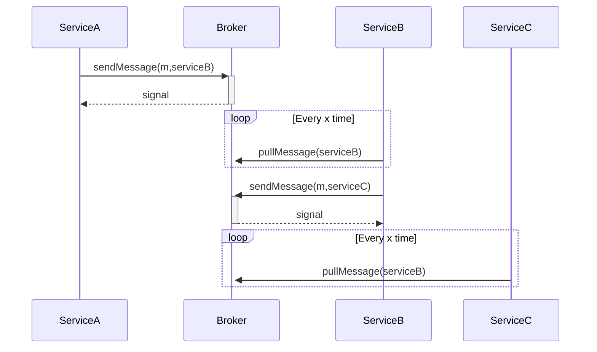

Di dalam sebuah perusahaan multinasional dengan skala besar biasanya memiliki ekosistem yang kompleks untuk saling berkomunikasi. Berkomunikasi yang dimaksudkan ialah semisal aktivitas bertukar data dan melakukan pengolahan informasi yang terintegrasi. Seringkali sistem yang dipakai oleh antar departemen atau antar group juga berbeda, apalagi jika berbeda region karena multinasional. Berikut sebagai adalah ilustrasi komunikasi antar sistem di sebuah perusahaan migas multinasional :



Dari diagram di atas sebetulnya masih jauh lebih sederhana jika dibandingkan kasus nyata di lapangan. Namun dapat dilihat bahwa integrasi antar aplikasi seringkali dilakukan secara face-to-face melalui beberapa metode yang sudah ditentukan. Aplikasi dapat berkomunikasi 2 arah dan multi channel tergantung relasi dari organisasi yang bersangkutan. Di beberapa departemen bahkan juga menggunakan beberapa sistem yang berbeda. Berikut beberapa faktor dan alasannya : 

1. Budget departemen terbatas ketika implementasi, sehingga membeli beberapa aplikasi dengan harga yang lebih murah padahal sebetulnya dapat menjadi satu
2. Memenangkan tender dari beberapa penyedia jasa dan produk yang berbeda dengan waktu implementasi yang berdekatan
3. Mendapatkan limpahan aplikasi dari bagian lain atau titipan dari atas (ini yang sering ditemukan)
4. Sedang migrasi dari sistem lama ke sistem baru namun tidak langsung berpindah atau bertahap

Maka pada realitanya diagram di atas dapat menjadi jaring laba-laba yang semakin ruwet dan kompleks. Berdasarkan pengalaman implementasi integrasi antar sistem termasuk tempat di mana saya pertama kali bekerja, di beberapa perusahaan telah menerapkan BPEL sebagai landasan regulasi. 

> BPEL ditentukan sebagai standar agar ruang komunikasi dapat diatur dan disimplifikasi prosesnya untuk menghindari redudansi pembuatan channel komunikasi yang berulang.

## Intro

Selama 3 tahun ini yang saya lihat kebanyakan adalah perusahaan multinasional yang menerapkan. Di tempat saya pertama kali bekerja sendiri sudah menerapkan BPEL sejak tahun 2008. 3 tahun sebelum saya bergabung. Mungkin untuk perusahaan lokal masih akan berjalan mengikuti trendnya suatu saat. Metode komunikasi antar sistem dengan standar BPEL jarang terdengar, karena di Indonesia orang lebih sering mengucapkannya sebagai SOA (*Service Oriented Architecture*) padahal BPEL dan SOA bukan hal yang sama. BPEL adalah dasar serta bagian dari SOA yang merujuk ke bisnis.

Berdasarkan buku dari [Martin Fowler](https://martinfowler.com/) series dengan judul [Enterprise Integration Patterns](https://www.goodreads.com/book/show/85012.Enterprise_Integration_Patterns) yang saya baca. Sebetulnya integrasi adalah bentuk dari komputasi dan data terdistribusi, serta berkaca pada pola bisnis yang juga terpisah seperti yang dilakukan dalam keseharian. Sebagai contoh nyata divisi finance, human resource, sales, marketting, dan operation pasti memiliki silo data tersendiri. Tidak semua diekspose untuk disharing. Nah bagaimana cara sharingnya data tersebut? Ada beberapa metode integrasi atau komunikasi data yang sebetulnya sering ditemukan. 

Pada literasi berikut saya juga tidak membahas mana yang lebih baik namun lebih tentang sharing tentang apa yang telah saya pelajari sekalian mencatatnya di sini. Mana yang lebih baik silakan ditentukan sendiri. Karena proper dan tidak proper setiap organisasi sudah menentukan mana yang terbaik tanpa perlu justifikasi di tempat A jelek dan di tempat B bagus. Bagi saya pribadi mana yang sesuai budget, lebih mudah untuk dicapai, dan aman sudah lebih dari cukup. Minimal salah satu dari 3 kriteria tersebut dapat tercapai tidak masalah. Best practice harus jadi acuan tetapi jika tidak tercapai maka terkadang lifehack juga harus ikut bermain.

Berikut adalah beberapa metode integrasi yang saya pernah (ikut) lakukan. Untuk metode file atau data yang diupload antar sistem tidak saya masukkan karena hal tersebut adalah fundamental sederhana yang kurang elok untuk dibahas.

## Database to Database

Metode yang pernah saya lakukan ini ketika implementasi integrasi antara ERP Dynamic Axapta dengan IBM Maximo untuk melakukan pendataan cost di finance ketika purchase request dibuat hingga menjadi purchase order dan akhirnya item yang dipesan masuk sebagai inventori proyek. Untuk gambaran flow bisnis yang dibangun adalah seperti di bawah ini



Kendala di lapangan yang dihadapi adalah IBM Maximo terinstall di site Kalimantan Selatan sedangkan Dynamic AX terdapat di head office Jakarta. **Kondisi jaringan antara head office dan site ternyata tidak optimal untuk web service. Saking parahnya sering terkena timeout ketika dicoba dengan menggunakan web service. Protokol HTTP lewat VPN di jalur publik agar aman seringkali terputus**. Pengadakan jasa tuning ternyata juga sangat mahal karena faktor lokasi dan di seberang pulau sehingga urung niat untuk dilakukan dalam waktu dekat.

Dikarenakan tiket insiden data terputus cukup tinggi maka diputuskan untuk menggunakan pendekatan integrasi data langsung antara database IBM Maximo dengan Dynamic AX. Karena kebetulan database IBM Maximo yang digunakan ada adalah dari replikasi ke master (site ke HO) yang intervalnya tidak terlalu jauh yaitu setiap 10 menit dan bukan melalui jaringan publik serta HTTP. Lokasi database IBM Maximo terdapat pada data center yang sama dengan database Dynamic AX. Latencynya pun menjadi cukup kecil. Sehingga akhirnya solusi ini dianggap menjadi keputusan sementara yang paling memungkinkan untuk dieksekusi.

Sharing dan pengiriman data antar database server menggunakan store procedure yang digrant aksesnya ke user khusus untuk integrasi. Data dari IBM Maximo (Maximo) akan dikirimkan ke Dynamic AX (AX) melalui scheduler job yang menarik data dalam bentuk batch purchase request lalu mengeksekusi store procedure di database AX dengan batch sebagai parameternya. Dari sisi AX juga akan memanggil store procedure di database Maximo untuk mengisi data pada tabel interface purchase order yang berikutnya akan dilock dan dikonsumsi oleh MIF (Maximo Integration Framework) Table Interface agar tidak terjadi duplikasi data.

Integrasi akhirnya dapat dilakukan namun sayangnya ketika cek log justru menjadi sulit dan memusingkan dikarenakan replikasi insiden harus dicoba di aplikasi dan cek resultnya di database. Lebih mudah apabila dapat dicek pada log aplikasi. Handle failover aplikasi juga cenderung sulit dan masih riskan untuk dibuat high availability dengan multi server. Takutnya terjadi duplikasi data pada bagian pengiriman data ke AX dengan database scheduler ketika berjalan parallel sehingga akan ada ekstra effort untuk melakukan perbaikannya.

Ketika implementasi IBM Maximo di Medan untuk sebuah pabrik,  pendekatan antar database juga kembali berlaku. Karena aplikasi ERP yang akan diintegrasikan ternyata adalah **aplikasi desktop in-house berbasis .NET 3.0 dan Delphi. Tidak dimungkinkan mengupdate ke versi yang support web service dikarenakan karena terkendala distribusi packagenya ke semua cabang**. Halangannya bukan jaringan namun kendala teknologi di aplikasi yang bersangkutan.

Belajar dari pain point implementasi di proyek sebelumnya, pada implementasi di tempat ini kami lebih memilih untuk tetap menggunakan integrasi via store procedure namun eksekusinya real time dari aplikasi. Ketika user melakukan create purchase order di Maximo maka akan langsung mengirimkan datanya lewat store procedure yang sudah disediakan oleh database aplikasi in-house melalui launch point event di Maximo. Ketika call store procedure gagal maka akan masuk ke dalam tabel queue yang akan diambil oleh MIF Tabel Interface untuk kemudian diulang pemanggilan store prosedurnya hingga (x) kali oleh JMS inbound.

> Oh iya *kenapa menggunakan MIF Table Interface?* Dikarenakan agar dapat menggunakan solusi high availability multi server tanpa perlu khawatir duplikasi data. Di dalam Table Interface terdapat mekanisme lock dan pool external data berbasis JMS (Java Messaging Service). Data yang masuk antrean hanya masuk ke salah satu application server secara round robin. JMS (Java Messaging Service) sendiri merupakan fitur out of the box dari IBM WebSphere Application Server.

Begitu juga sebaliknya dari ERP In-House akan mengeksekusi event yang mentrigger store procedure di database Maximo untuk memasukkan datanya ke tabel queue. Data dari tabel queue akan dikonsumsi oleh MIF Table Interface dan apabila error di sisi Maximo maka akan diretry hingga (x) kali. Namun jika gagalnya di sisi klien dan belum masuk ke tabel queue maka harus diretry dari klien atau insert manual ke tabel queue meski tidak disarankan.  

Dari 2 kasus implementasi yang pernah saya hadapi, ternyata solusi integrasi antar database dapat menjadi opsi. Namun menjadi rentan terhadap kesulitan troubleshot di level aplikasi dan ada kemungkinan duplikasi data ketika dieksekusi oleh consumer atau scheduler yang berjalan pada beberapa server. Sebagai mitigasi harus melakukan tweak lebih lanjut seperti misalnya dengan melakukan lock resource agar tidak jalan bersamaan antar server yang berpotensi memproses data yang sama. Integerasi database to database juga cara paling mudah karena 30% waktu saya untuk teknis hanya di query saja.

## Komunikasi Modular

Komunikasi modular adalah salah satu jenis komunikasi antar module di dalam sistem yang teknologinya homogen. Setidaknya begitu dari sudut pandang saya. Solusi yang paling sering saya terapkan untuk komunikasi modular adalah dengan [EJB (Enterprise Java Beans)](https://en.wikipedia.org/wiki/Jakarta_Enterprise_Beans) karena kebetulan ekosistem yang digunakan mayoritas menggunakan Java. Jika ditarik ke low level sebelum mengenal EJB pernah juga dengan [RMI](https://www.tutorialspoint.com/java_rmi/java_rmi_introduction.htm) atau Remote Method Invocation yang menjadi spesifikasi (JSR) dari remote object di EJB. Namun RMI tidak selengkap EJB tentunya untuk perihal fitur semisal message driven, session, transaction management, dan lainnya.

Sebagai gambaran besar sistem berbasis Java yang pernah saya ikut kembangkan, rata-rata menggunakan rangka modular dengan Maven. Satu parent project dapat dishare base codenya untuk satu hingga beberapa child project. Misal saya sedang mengembangkan aplikasi untuk BOM (Bill of Material) dan merupakan bagian dari module purchasing yang dapat berkomunikasi dengan aplikasi lainnya yang ada di module purchasing seperti Purchase Order serta Purchase Request.

Maka struktur POM di project sekiranya seperti terlampir :

**Parent Project**
```
<project xmlns="http://maven.apache.org/POM/4.0.0" xmlns:xsi="http://www.w3.org/2001/XMLSchema-instance" xsi:schemaLocation="http://maven.apache.org/POM/4.0.0 http://maven.apache.org/xsd/maven-4.0.0.xsd;
    <modelVersion>4.0.0</modelVersion>
    <groupId>id.co.company.purchase</groupId>
    <artifactId>purchase-module</artifactId>
    <version>1.0-snapshot</version>
    <packaging>pom</packaging>
    <name>purchase-module</name>
    <url>http://maven.apache.org</url>
 
    <properties>
        
    </properties>
 
    <dependencies>
        <dependency>
            <groupId>...</groupId>
            <artifactId>...</artifactId>
            <version>...</version>
            <scope>...</scope>
        </dependency> 
    </dependencies>
</project>  
```
**Purchase Order Project**
```
<project xmlns="http://maven.apache.org/POM/4.0.0" xmlns:xsi="http://www.w3.org/2001/XMLSchema-instance" xsi:schemaLocation="http://maven.apache.org/POM/4.0.0 http://maven.apache.org/maven-v4_0_0.xsd">
    <!--The identifier of the parent POM-->
    <parent>
        <groupId>id.co.company.purchase</groupId>
        <artifactId>purchase-module</artifactId>
        <version>1.0-snapshot</version>
    </parent>
    <modelVersion>4.0.0</modelVersion>
    <artifactId>purchase-order</artifactId>
    <name>purchase-order</name>
    <packaging>jar</packaging>
    
    <dependencies>    
        ...
    </dependencies>
</project>
```

**Purchase Request Project**
```
<project xmlns="http://maven.apache.org/POM/4.0.0" xmlns:xsi="http://www.w3.org/2001/XMLSchema-instance" xsi:schemaLocation="http://maven.apache.org/POM/4.0.0 http://maven.apache.org/maven-v4_0_0.xsd">
    <!--The identifier of the parent POM-->
    <parent>
        <groupId>id.co.company.purchase</groupId>
        <artifactId>purchase-module</artifactId>
        <version>1.0-snapshot</version>
    </parent>
    <modelVersion>4.0.0</modelVersion>
    <artifactId>purchase-request</artifactId>
    <name>purchase-request</name>
    <packaging>jar</packaging>
    
    <dependencies>    
        ...
    </dependencies>
</project>
```
**BOM Project**
```
<project xmlns="http://maven.apache.org/POM/4.0.0" xmlns:xsi="http://www.w3.org/2001/XMLSchema-instance" xsi:schemaLocation="http://maven.apache.org/POM/4.0.0 http://maven.apache.org/maven-v4_0_0.xsd">
    <!--The identifier of the parent POM-->
    <parent>
        <groupId>id.co.company.purchase</groupId>
        <artifactId>purchase-module</artifactId>
        <version>1.0-snapshot</version>
    </parent>
    <modelVersion>4.0.0</modelVersion>
    <artifactId>bill-of-material</artifactId>
    <name>bom</name>
    <packaging>jar</packaging>
    
    <dependencies>    
       ...
    </dependencies>
</project>
```
Dari struktur di atas maka akan menghasilkan 3 java archive yaitu purchase-order-1.0-snapshot.jar, purchase-request-1.0-snapshot.jar, dan bom-1.0-snapshot.jar yang base codenya berasal dari purchase-module.pom. Java archive tersebut dideploy ke application server. Secara fisik module purchasing memiliki 3 aplikasi yang berjalan secara terpisah. Di sini saya anggap 1 aplikasi memiliki 1 skema tersendiri agar lebih independen dan aman secara integritas data. Tanpa takut ketika alter tabel maka akan ada dampak di aplikasi lainnya. 

> Lalu bagaimana agar setiap aplikasi tersebut dapat berkomunikasi secara modular?





Dari diagram di atas maka setiap komunikasi akan menggunakan fungsi pada interface untuk melakukan remote object terhadap aplikasi lain. Semisal dari Bill of Material membutuhkan detail Purchase Ordernya berdasarkan nomor invoice maka dapat call object Purchase Order melalui fungsi ```getDetailPurchaseOrder(invNo)``` yang dideklarasikan pada sebuah interface. Namun sebagai syaratnya adalah class Purchase Order di setiap aplikasi sebaiknya identik atau sharing dari aplikasi Purchase Order karena terdapat aktivitas marshall dan unmarshall object yang dikirimkan melalui jaringan. 

> EJB selain menggunakan remote object menggunakan proxy dan stub pada jaringan untuk saling berkomunikasi, agar dapat saling terkoneksi juga dapat menggunakan JNDI sebagai informasi alamat. Ibarat seperti URL pada webservice.

Dari beberapa literasi yang saya baca dan sekilas mencoba di beberapa bahasa pemrograman, setiap bahasa memiliki pendekatannya sendiri-sendiri agar dapat saling berkomunikasi secara homogen. Misal .NET menggunakan WCF dan dasarnya sendiri adalah .NET Remoting. PHP umumnya menggunakan standar RPC. Hampir semuanya menggunakan singleton pattern, interface, dan marshal unmarshall object untuk remote melalui socket. Dasar konsepnya kurang lebih sama seperti pemrograman jaringan.

**Komunikasi secara modular memungkinkan efisiensi resource pada sistem operasi karena sistem yang dibangun tidak perlu lagi berdiri di dalam satu bangunan besar serta memungkinkan untuk dipecah ke dalam beberapa cluster**. Dan meskipun terpisah tetap dapat berkomunikasi untuk menunjang kebutuhan bisnis. Ada keuntungan lainnya ketika memecah sistem secara modular, yaitu adalah meminimalkan dampak ketika terjadi perubahan dengan tidak perlu lagi deploy sistem secara keseluruhan.

Di salah satu perusahaan migas lokal saya mengerjakan sebuah proyek implementasi upgrade layanan IBM Maximo ke SmartCloud untuk IT Service Management. Pada implementasinya saya dibantu oleh para engineer user untuk memisahkan setiap jar dan EARnya bahkan hingga dibuat dalam bentuk versi. Sehingga ketika deploy ke WebSphere dan muncul masalah dikarenakan EAR yang baru maka tidak akan terdampak ke versi-versi sebelumnya. User bisnis pun tetap dapat mengakses versi yang lama.

Untuk meningkatkan performa, beberapa module jar yang sifatnya runnable juga dipisah ke beberapa VM yang telah terinstall WebSphere secara cluster sehingga overall cukup reliable kalau berbicara tentang scaling. Untuk meningkatkan spesifikasi application server mana yang berat menjadi lebih mudah untuk ditentukan. Hal tersebut lumrah dilakukan untuk aplikasi yang telah berjalan selama kurang lebih 8 tahun. Saya pernah backup data di production untuk kurun waktu setahun dan berukuran 4.5TB. Sehingga jika semua berjalan dalam satu server non-cluster sudah pasti akan terasa sekali performanya menurun.

> Kecepatan pengiriman data pada socket jaringan lebih cepat dibandingkan dengan menggunakan web service, namun jika arsitektur yang diterapkan tersusun dari teknologi yang heterogen maka komunikasi dengan modular akan menjadi sulit
{: .prompt-info }

## Web Service
Web service adalah salah satu bentuk layanan yang menjadi favorit saya ketika membangun komunikasi pada sistem. Dikarenakan berbasis protokol web maka dapat ditest pada browser atau testing suit seperti SoapUI. Berbeda dengan EJB yang saya harus hands on koding dan membuat unit test agar dapat mengetahui seperti apa responsenya. Dengan menggunakan web service saya juga lebih mudah untuk mengintegrasikan antar aplikasi yang dibangun dengan teknologi yang berbeda, sehingga lebih universal daripada komunikasi modular.


_Web Service : Wikipedia_

Web Service yang biasa saya gunakan adalah dalam bentuk format XML, biasanya bertipe SOAP dan memiliki UDDI (Universal Description, Discovery, and Integration) untuk discovery layanan yang telah saya kembangkan. Sehingga pengembang lain cukup saya infokan saja UDDInya dan mereka dapat mendownload untuk diwrap sesuaikan dengan koding mereka. Dengan format XML maka semua bahasa juga lebih mudah dalam melakukan translasi, itulah kenapa web service lebih friendly untuk multi platform.

Namun ada yang satu hal lagi yang saya paling suka dari web service adalah pengaturan keamanannya. Jika dengan modular maka harus dua kali bekerja untuk memproteksinya karena selain di controller juga proteksi akses protokol remote soketnya. Sedangkan untuk web service semua akses berasal dari request path controllernya. Sehingga ketika saya mengamankannya bebas apakah akan dilakukan per end point atau dapat langsung handle pada interceptor global security.

Selain pengaturan keamanan, mudahnya discover service pada UDDI menjadi keunggulan bagi konsumen API. Pengembang pun dapat menerapkan API yang lebih semantik hanya dengan mendefinisikan HTTP methodnya berdasarkan entitas. Misal POST untuk add data, PUT untuk update data, dan DELETE untuk delete data. Di beberapa layanan di luar negeri seperti di Foursquare saya cek di sandbox pengembangnya melakukan penamaan semantik, bahkan setiap APi dapat diberikan version sehingga konsumen API lebih jelas mana saja API yang akan obsolete.

Web service sendiri sebetulnya adalah kontrak komunikasi antar beberapa pihak, sehingga harus didiskusikan secara detail dan ada kata sepakat. Apa saja yang perlu disepakati? Semisal standar payload dan responsenya serta header yang biasa digunakan untuk pengecekkan security. Format pun juga dapat didiskusikan karena penggunaan RESTful web service sudah semakin hype serta menjadi trend atau mau tetap dengan SOAP. Dokumentasi juga memiliki peran penting sehingga UDDI yang terpublish sebaiknya diinfokan ke konsumen API termasuk jika terdapat perubahan.

## Message Broker

Selama bekerja kurang lebih hampir 3 tahun, message broker adalah teknologi yang sangat asing bagi saya. Saat masih kuliah pun saya belum pernah menyentuhnya, hanya sempat membaca artikel dari beberapa pengembang luar yang menceritakan tentang manfaatnya dalam membangun sistem yang terdistribusi secara asynchronous. Tentang asynchronous, nama patternnya pun tampak keren dan kalau tidak salah baca adalah fire and forget pattern. Diagram-diagram berikut adalah gambaran bagaimana interaksi antar sistem melalu sebuah medium "broker".

> Kedua contoh diagram berikut dapat dikatakan fire and forget di mana producer hanya sekedar memasrahkan pesan kepada "broker" untuk diteruskan kepada consumer, tidak mempermasalahkan diterima atau tidaknya oleh consumer.

**Skema Broker Aktif** yaitu service producer menggunakan layanan pengiriman pesan ke service consumer melalui broker, dan broker yang akan meneruskan kepada service consumer yang akan dituju berdasarkan channel atau topik. Service consumer akan segera menerima dengan listener terrhadap topiknya. Pesan yang dikirimkan oleh pengirim hanya akan benar-benar terhapus ketika consumer telah menerima pesan.

**Skema Broker Pasif** yaitu service producer menggunakan layanan pengiriman pesan ke service consumer melalui broker namun broker hanya sebagai penampung data saja. Pesan yang dikirimkan akan diletakkan pada sebuah channel atau topik di mana topik tersebut sudah dibook oleh service consumer yang mengecek secara rekursif. Sehingga secara berkala akan mencari pesan yang ada pada topik broker tersebut. Pesan tersebut dapat diset hanya sementara waktu.

Pendekatan ini biasanya dilakukan ketika terdapat kebutuhan bisnis yang memerlukan broker namun sifatnya tidak kritikal dan tidak ingin mengganggu kinerja broker. Segera terkirim syukurlah, tidak terkirim sama sekali pun juga tidak apa. Broker pun berhak menghapus pesan jika terlalu lama idle. Sebagai contohnya adalah kirim email atau notifikasi tentang promo hari ini ke pelanggan yang telah subscribe layanan e-commerce. Jika rate pesan gagal terkirim tidak mempengaruhi penilaian bisnis maka dapat menggunakan pendekatan ini.

Tampaknya perusahaan travel agent seperti tiket.com juga sudah menggunakan message broker. Karena e-ticket yang saya beli biasanya tidak selalu langsung saat itu juga terkirim, namun terkadang harus menunggu hinga beberapa menit sampai pernah satu jam berikutnya baru terkirim ke e-mail setelah payment. Beberapa produk dari message broker adalah seperti ActiveMQ, IBM MQ, dan RabbitMQ.

## Middleware

Middleware untuk integrasi atau sering juga disebut dengan ESB (Enterprise Service Bus) merupakan komponen yang cukup vital bagi perusahaan. Dari pengalaman saya dulu pernah mengerjakan integrasi di bagian insentif, integrasi yang cukup berulang berulang adalah pada bagian transfer ke bank. Sebetulnya baik reimburse ataupun payroll, API transfer to bank yang dipanggil itu sama bahkan ledger ataupun source accountnya nya pun tidak ada beda. Namun dikarenakan aplikasi payroll menggunakan SAP sedangkan reimburse menggunakan aplikasi HRIS internal maka jika tanpa ESB kedua aplikasi harus didaftarkan sebagai klien dari API transfer ke bank.


_Credit : Tech Target_

Dengan menggunakan ESB maka saya cukup mendaftarkan ESB saya sebagai klien dari API transfer ke bank. Sedangkan SAP dan HRIS tidak perlu saya masukkan sebagai klien. Lalu bagaimana cara agar SAP dan HRIS dapat transfer ke bank? Dengan ESB saya dapat mengembangkan proxy API transfer to bank lalu proxy ini yang dipanggil oleh SAP dan HRIS. Sehingga ESB bertugas menjadi agregator layanan bagi beberapa aplikasi. Dengan adanya ESB saya dapat melihat katalog proxy API saja yang sudah ada dan dapat direuse oleh klien saya. Biasanya proxy API yang dibuat sudah dikumpulkan berdasarkan BPELnya.

Ketika pengembang mencari API dapat seperti ketika melihat buku menu di rumah makan. Dengan adanya buku menu API tadi maka dapat meminimalkan pengembangan dan pendaftaran klien API secara berulang. Pengamanan sistem pun juga dapat dilakukan secara sentral di proxy API, sehingga setiap klien proxy API akan menggunakan standar autentikasi yang sama. Keuntungan lainnya semisal dari pihak bank merubah payload transaksi maka chain effect akan terjadi mulai dari proxy hingga klien proxy. Sehingga saya dapat mengetahui klien mana saja yang belum melakukan update payload.


**Studi kasus**
> Dengan adanya ESB sebagai middleware efisiensi kerja juga menjadi lebih optimal. Misal aplikasi A saat ini harus melayani integrasi aplikasi B hingga aplikasi Z. Maka tim dari aplikasi A harus menginfokan spesifikasinya ke semua pihak terkait. Dan apabila terdapat pihak lain yang tidak bertanggung jawab mencoba akses APInya maka pengurus aplikasi A harus menindak lanjuti. Pengurus aplikasi A memiliki beban yang berat padahal seharusnya dapat fokus di bisnis. Dengan adanya ESB, maka sebaiknya API dari aplikasi A cukup diekspose ke ESB. Aplikasi B hingga Z dapat mengakses aplikasi A melalui proxynya di ESB. Akses keamanan API yang sering diakses sebaiknya diatur pada ESB dan proxynya, khususnya juga untuk akses proxy yang menuju eksternal organisasi.
{: .prompt-info }

Di kantor lama saya menggunakan ESB tools dari Oracle Service Bus, rata-rata fitur antar tools mirip. Di tahun ini kalau tidak salah yang sedang hype adalah [Mulesoft](https://www.mulesoft.com/). Ada salah satu fitur dari Mulesoft yang mungkin cocok untuk diimplementasikan, yaitu mampu mengkonversi dari format XML ke JSON dengan seamless. Baik untuk request ataupun responsenya. Fitur ini seingat saya belum ada di Oracle Service Bus ataupun Software AG. Penerapan ESB juga sebaiknya mempertimbangkan budget serta kompleksitas dari komunikasi antar sistem di sebuah perusahaan. Jika tidak terlalu kompleks dapat menunda pengadaan serta implementasi ESB. Namun jika kompleks dan mulai besar jumlah channel komunikasi agar tidak membuat proses integrasi dari 0 secara berulang maka sebaiknya mempertimbangkan penggunaan ESB.

Bahasan tentang middleware sekaligus menutup pembahasan metode integrasi antar sistem. Sekian artikel dari saya tentang metode integrasi, kiranya semoga bermanfaat dan apabila ada pandangan lain boleh disharing karena sharing is caring. Terimakasih.

*Disadur dari blog lama saya di WordPress.com*